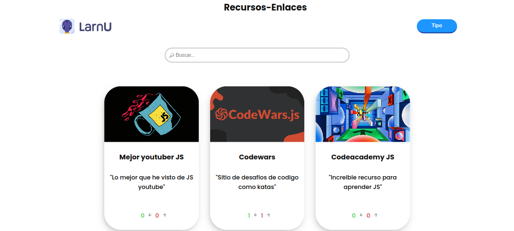

# desafio de frame 10 

  <h1>👽 Proyecto grupal</h1>
  <strong>Documentación del proyecto y marcos de trabajo que se utilizan</strong> 
  <strong>Construido por la comunidad de LarnU. Mantenido por LarnU</strong>

 

## Que es el panel frontal de devs de larnU?

Desarrollar una barra de busqueda de filtrado
 

### 🏗 Equipo de Ingeniería  

- [@T0ny-dev](https://github.com/T0ny-dev)

### 👨‍💻 Listados de marcos de trabajo

* HTML
* CSS
* JavaScript

### 🗎 descargar de proyecto y colabora

* para descargar `git clone` y abrir en explorador

### 🗎 Capturas

